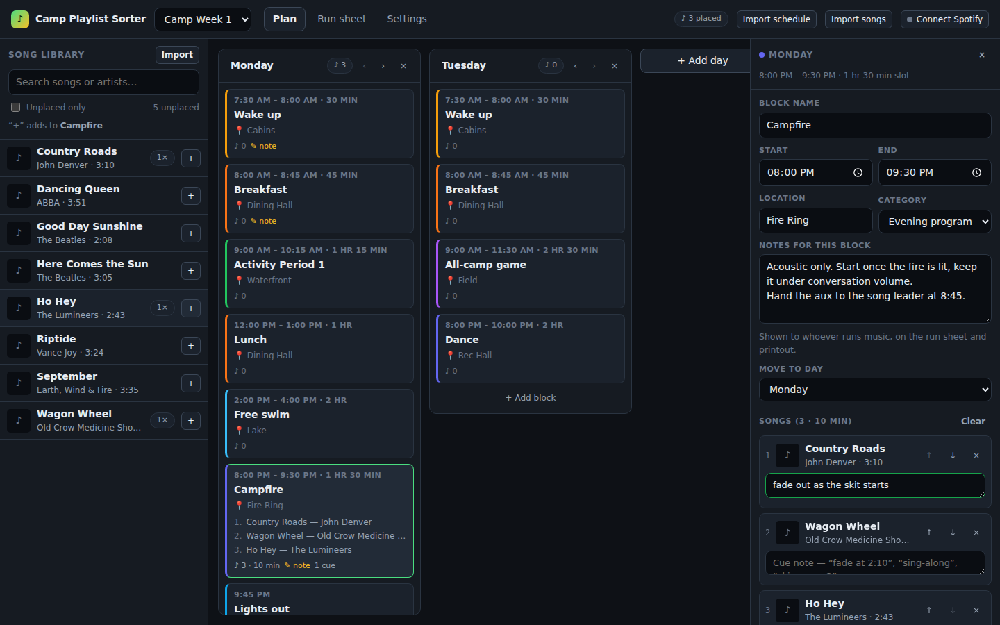
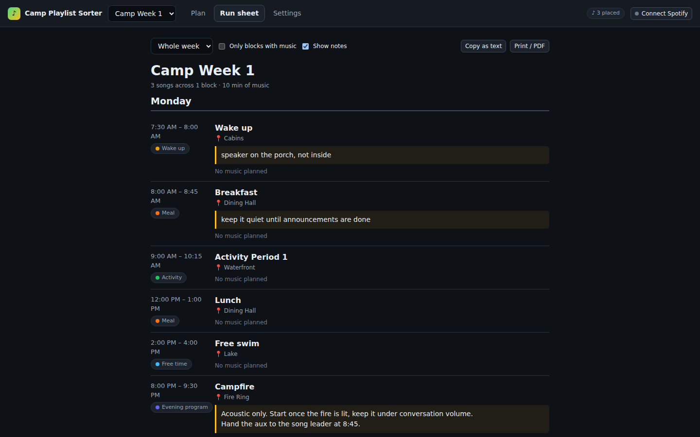

# Camp Playlist Sorter

A web app for planning **which songs play during which parts of a week at summer camp**.

Import your camp schedule, pull in a Spotify playlist, drop songs onto the blocks
where they belong, and leave notes so whoever is running music knows what to do —
then print or pull up the run sheet during the week.





## What it does

- **Import a schedule** — paste it as plain text, or upload a `.csv`, `.txt`, or `.ics`
  calendar export. Days, times, locations, categories and notes are picked up
  automatically.
- **Import songs from Spotify** — any playlist you own, follow, or have a link to.
- **Assign songs to blocks** — drag from the library onto a block, or select a block
  and use the `+` button (which works on a phone, where drag-and-drop doesn't).
- **Leave notes** — a note per schedule block ("acoustic only, keep it under
  conversation volume") and a cue note per song ("fade at 2:10", "sing-along").
- **Run sheet** — a clean, printable, phone-friendly view of the whole week: every
  block in order, its notes, and its songs with cues. Copies as plain text too.
- **Push back to Spotify** — turn any block, or every day, into a real Spotify playlist.
- **Multiple weeks** — one plan per camp session; duplicate one to start the next.

Everything is stored in your browser. Nothing is sent anywhere except Spotify, and
there is no server to run or account to make. Export a JSON backup to move between
computers or hand the plan off to next year's music person.

## Getting started

```bash
npm install
npm run dev          # http://127.0.0.1:5173
```

Other scripts:

| Command | What it does |
| --- | --- |
| `npm run dev` | Dev server with hot reload |
| `npm run build` | Type-check and build to `dist/` |
| `npm run preview` | Serve the production build |
| `npm test` | Run the schedule-parser tests |
| `npm run check` | Type-check plus tests |

### Connecting Spotify

The app is entirely client-side, so there is no shared client secret — it uses the
Authorization Code + PKCE flow with a Client ID you supply. One-time setup:

1. Open the [Spotify developer dashboard](https://developer.spotify.com/dashboard)
   and **Create app** (any name).
2. Add the redirect URI the app shows you under **Settings → Spotify** — for local
   development that is `http://127.0.0.1:5173/`. It must match exactly.
   Tick **Web API**, then save.
3. Paste the app's **Client ID** into the app and click **Connect to Spotify**.

The Client ID and the resulting tokens stay in your browser's `localStorage`.

Scopes requested: `playlist-read-private`, `playlist-read-collaborative`,
`playlist-modify-private`, `playlist-modify-public`.

To bake in a Client ID for a deployed copy, set `VITE_SPOTIFY_CLIENT_ID` at build
time; the in-app field still overrides it.

## Schedule formats

### Plain text

The format most camp schedules already look like:

```
Monday
7:30-8:00 Wake up @ Cabins | speaker on the porch, not inside
8:00-8:45 Breakfast @ Dining Hall
  note: keep it quiet until announcements are done
9:00-10:15 Activity Period 1 @ Waterfront
12:00-1:00 Lunch @ Dining Hall
2:00-4:00 Free swim @ Lake
8:00-9:30 Campfire @ Fire Ring | slow songs only, no explicit
9:45 Lights out
```

- A line with **no time** starts a new day (`Monday`, `Day 3`, `2026-06-22`).
- A line starting with a **time or time range** is a block.
- `@ Place` sets the location, `| text` and `note:` lines become notes, and
  `[Meal]` sets a category.
- **Times without AM/PM are read in schedule order.** `2:00-4:00` after lunch
  becomes 2:00 PM, and `8:00 Campfire` after that becomes 8:00 PM — a bare time
  that would move the clock backwards is nudged forward twelve hours. Times that
  state AM/PM, or that can only be 24-hour, are never touched. The import preview
  reports every adjustment so you can spot-check it.

### CSV

Any of these header names work, in any order:
`day`/`date`, `start`, `end`, `title`/`activity`/`event`, `location`, `category`, `notes`.

```csv
Date,Start Time,End Time,Activity,Where,Details
Monday,7:30 AM,8:00 AM,Wake Up,Cabins,"speaker on the porch, not inside"
Monday,8:00 PM,9:30 PM,Campfire,Fire Ring,slow songs only
```

### Calendar (`.ics`)

Export from Google Calendar or Outlook and upload it directly. Events are grouped
into days by date.

## How it's built

- React 18 + TypeScript + Vite, no backend and no UI framework.
- State lives in a reducer (`src/lib/store.tsx`), persisted to `localStorage` and
  exportable as JSON.
- The schedule parser (`src/lib/parseSchedule.ts`, `src/lib/time.ts`) is pure and
  covered by tests in `test/`.
- Spotify PKCE auth in `src/spotify/auth.ts`; API calls in `src/spotify/api.ts`.

### Deploying

`npm run build` emits a static `dist/` you can host anywhere. To serve from a
subpath (GitHub Pages, say), build with `APP_BASE=/bmxc-playlist-sorter/ npm run build` —
then register that URL as the redirect URI in your Spotify app.
